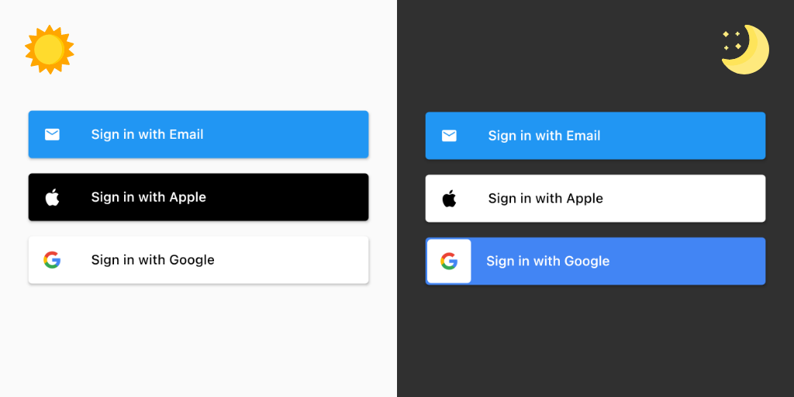

# Arculus Auth Widgets

Collection of flutter auth-related widgets such as social sign in buttons, splash page, and sign in page, etc. These widgets are designed to work nicely with your app theming as well as respective brand guidelines. Feel free to post an issue if there's anything wrong.

For your convenience, you can see the button brand guidelines here:
- [Apple](https://developer.apple.com/design/human-interface-guidelines/sign-in-with-apple/overview/buttons/)
- [Google](https://developers.google.com/identity/branding-guidelines)

As for the email sign in button, I just use the default theming of `ElevatedButton`, which is usually have background color equals to your app's primary color, and foreground color equals to your app's primaryTextTheme.button (Primary Text Theme = Text Theme with color contrast to your primary color.)

# About Brightness / Theme Mode

Flutter's `ThemeData` has a property called `themeMode`. ThemeMode is basically tells the flutter app which theme to use. I usually use `ThemeMode.system` to make the app theme matches the user's device system configuration.

- ThemeMode.light = Uses `ThemeData.theme`.
- ThemeMode.dark = Force use `ThemeData.darkTheme`.

# Features

## Generic Button


Generic buttons basically just plain `ElevatedButton.icon()`.

```dart
GenericEmailButton(label: 'Sign in with Email', onPressed: (_) {});
GenericAppleButton(label: 'Sign in with Apple', onPressed: (_) {});
GenericGoogleButton(label: 'Sign in with Google', onPressed: (_) {});
```


And since they are basically a `ElevatedButton`, they will adapt to your `ElevatedButtonThemeData` in your root `ThemeData`. For example, I can modify the style of the button to be rounded with `elevatedButtonTheme`'s shape like below. (See the rounded google dark button with that nice circular white background? 😉)

```dart
class MyApp extends StatelessWidget {
  OutlinedBorder getBorder(Set<MaterialState> states) {
    return RoundedRectangleBorder(
      /// The value 100 doesn't really matter because, afaik, it will be rounded down to 50% 
      /// of the final height of the widget. (Please correct me if I'm wrong)
      borderRadius: BorderRadius.circular(100), 
    );
  }

  @override
  Widget build(BuildContext context) {
    return MaterialApp(
      themeMode: ThemeMode.light  /// Use ThemeMode.dark to force darkTheme or ThemeMode.system to match device's theme.
      /// Other codes
      theme: ThemeData(
        brightness: Brightness.light
        /// Other codes
        elevatedButtonTheme: ElevatedButtonThemeData(
            style: ButtonStyle(
          shape: MaterialStateProperty.resolveWith(getBorder),
        )),
      ),
      darkTheme: ThemeData(
        brightness: Brightness.dark
      /// Other codes
        elevatedButtonTheme: ElevatedButtonThemeData(
            style: ButtonStyle(
          shape: MaterialStateProperty.resolveWith(getBorder),
        )),
      ),
      /// Other codes
    );
  }
}
```

## Arculus Style Button



Arculus-Style buttons are still `ElevatedButton` at heart, but with more adjustments to make it nicer-looking (for my taste). And yes, they will still adapt to your `ElevatedButtonThemeData` in your root `ThemeData`. (though maybe not as flexible as the generic ones)

```dart
ArculusEmailButton(label: 'Sign in with Email', onPressed: (_) {});
ArculusAppleButton(label: 'Sign in with Apple', onPressed: (_) {});
ArculusGoogleButton(label: 'Sign in with Google', onPressed: (_) {});
```


They can also be made rounded, similar to how you make the generic ones rounded.

```dart
class MyApp extends StatelessWidget {
  OutlinedBorder getBorder(Set<MaterialState> states) {
    return RoundedRectangleBorder(
      /// The value 100 doesn't really matter because, afaik, it will be rounded down to 50% 
      /// of the final height of the widget. (Please correct me if I'm wrong)
      borderRadius: BorderRadius.circular(100), 
    );
  }

  @override
  Widget build(BuildContext context) {
    return MaterialApp(
      themeMode: ThemeMode.light /// Use ThemeMode.dark to force darkTheme or ThemeMode.system to match device's theme.
      /// Other codes
      theme: ThemeData(
        brightness: Brightness.light
        /// Other codes
        elevatedButtonTheme: ElevatedButtonThemeData(
            style: ButtonStyle(
          shape: MaterialStateProperty.resolveWith(getBorder),
        )),
      ),
      darkTheme: ThemeData(
        brightness: Brightness.dark
        /// Other codes
        elevatedButtonTheme: ElevatedButtonThemeData(
            style: ButtonStyle(
          shape: MaterialStateProperty.resolveWith(getBorder),
        )),
      ),
      /// Other codes
    );
  }
}
```

## Brand Logo

In case you needed it, you can use the available plain logo. Note that `GoogleLogo()` doesn't come with the default white background regardles your app's brightness. The apple one will still matches the `Brightness` of your active theme

```dart
GoogleLogo();
AppleLogo();
```

# Overriding root themeMode

In case you need the button to diverge from the root `themeMode`, you can wrap your button with a modified Theme. For example, you have your app themeMode set to `ThemeMode.light`, but you want to use the dark mode version of the google button. You can then do this:

```dart
Theme(
  data: Theme.of(context).copyWith(brightness: Brightness.dark),
  child: GenericGoogleButton(label: 'Sign in with Google', onPressed: (_) {})
),
```

# Coming Soon
- Other social buttons (Request in Issue!)
- Predefined splash page
- Predefined onboarding page